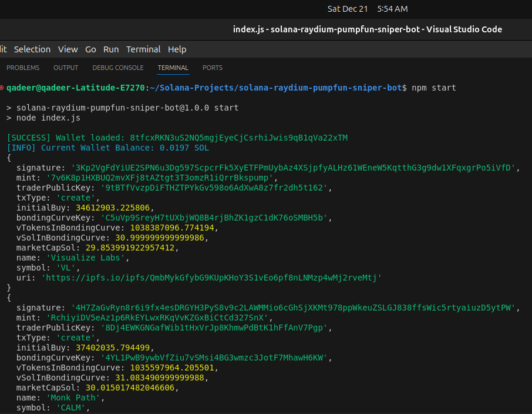

How to run Solana-Raydium-Pumpfun-Sniper-Bot

## 1 Clone repo

```bash
git clone https://github.com/Diveinprogramming/solana-raydium-pumpfun-sniper-bot.git
cd solana-raydium-pumpfun-sniper-bot
```
## 2 Install Modules

```bash
npm install
```

## 3 Load env parameters

RPC_URL =https://api.mainnet-beta.solana.com

TARGET_TOKEN =TOKEN_MINT_ADDRESS_HERE

WALLET_PRIVATE_KEY =

BUY_PRICE_LIMIT = 0.01

JITO_TIP = 0.000005

SNIPER_INTERVAL = 3000


## 4 Run bot 

```bash
npm start
```




## 5 Signatures

```bash
3ovim5X1hZNprVXxqTv3k6Kb9eC4FudepHydZegdJwoAiTDGtWBvCixaucw3GNMUTT47Rk8w64JaYKWpJQniQHw8
```

